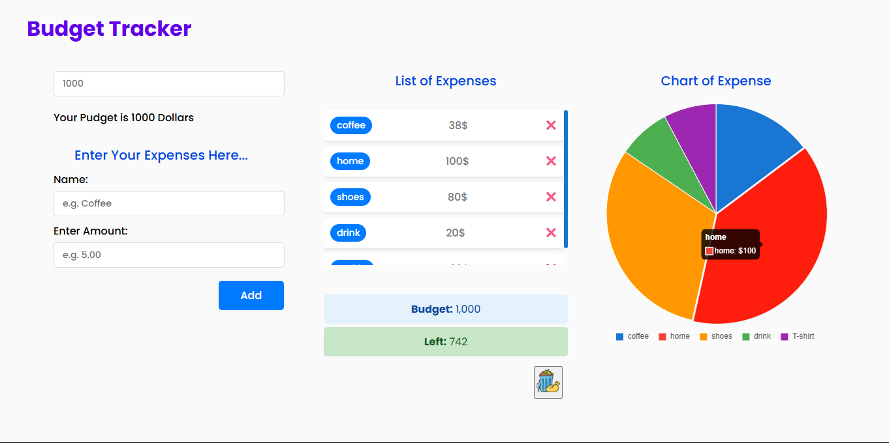

# 💰 Budget Tracker App

Track your daily expenses, set a budget, and visualize your spending easily.

## 🌟 Live Demo
🔗 [View budget-tracker-app]()


## ✨ Features

- ✅ Add and delete expenses
- ✅ Budget summary with remaining calculation
- ✅ Pie chart visualization of expenses
- ✅ Responsive design (mobile-friendly)
- ✅ Animations & Transitions using Framer Motion.
- ✅ Persistent storage using localStorage
- ✅ Clean and simple UI


## 🛠️ Tech Stack

- **React.js**
- **Chart.js** (via `react-chartjs-2`)
- **Framer Motion** (optional animation)
- **CSS Modules**
- **LocalStorage** for persistent state


## 🧠 React Concepts Used

- `useState` for managing form and budget states
- `useEffect` for syncing data with localStorage
- `props` for component communication


## 📊 Beautiful & Easy Chart Integration

The app uses `react-chartjs-2` and `Chart.js` to build a simple and visually rich pie chart. With just a few lines of code and smart use of colors, you can turn budget data into an interactive pizza-slice-style chart — perfect for quick visual insights.





## 🚀 Getting Started

### Clone the repository

```bash
git clone https://github.com/HseinKt/budget-tracker-app.git
```
cd budget-tracker-app

## 📬 Contact
Feel free to connect with me:
- 📧 Email: hseinkteish21@gmail.com
- 💼 LinkedIn: [Your LinkedIn](https://www.linkedin.com/in/hussein-kteish-287783212/)
- 🐙 GitHub: [Your GitHub](https://github.com/HseinKt)

💡 **Made with ❤️ & React.js**

